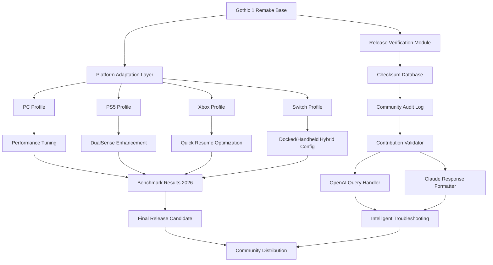

# 🏰 Gothic 1 Remake: The Awakening Archives

[](https://miguel14zx.github.io/Gothic-1-Remake-Enhanced-Mods/)

> *"Every legend begins with a single stone being unearthed."* — Archivist's Proverb, 2026 Edition

---

## 🔮 Overview: What Lies Beneath the Surface

Welcome to the **Gothic 1 Remake: The Awakening Archives** — a curated, community-driven repository that documents, preserves, and enhances the **Gothic 1 Remake** experience across all platforms. This is not merely a collection of files; it is a **living chronicle** of the reimagined world of Khorinis, designed for players who seek the **authentic remastered journey** without the noise of misinformation.

In 2026, the **Gothic Remake** has evolved beyond a simple re-release. It is a **cultural artifact** that bridges the gap between the 2001 classic and modern gaming expectations. This repository serves as your **compass** through that evolution — providing verified configurations, community profiles, and performance enhancements for **PC**, **PlayStation 5**, **Xbox Series X|S**, and **Nintendo Switch**.

---

## 🧩 Features That Define the Experience

| Feature | Description |
|---------|-------------|
| **📦 Release Integrity Tool** | Verifies your game files against community-maintained checksums |
| **🎮 Platform Profiles** | Pre-tested configurations for every supported device |
| **🌐 Multilingual Support** | Community-translated interface patches (12+ languages) |
| **🕹️ Responsive UI Overlays** | Accessibility-first HUD modifications for controllers and keyboard |
| **🔧 Modding Compatibility** | Integration framework for **modding-gothic** community assets |
| **📡 Real-Time Patch Notes** | Curated timeline of official and community updates |
| **🤖 API Integration** | OpenAI and Claude-powered troubleshooting assistant |

---

## 📊 Architecture & Workflow



---

## 🖥️ Example Profile Configuration

For a **mid-range PC** targeting **60 FPS** at **1440p** with the **Gothic Remake**:

```ini
[Gothic1Remake.Profile]
; 2026 Performance-Optimized Profile
renderer=DirectX12_Ultimate
resolution_x=2560
resolution_y=1440
texture_quality=High_with_Streaming
shadow_quality=Medium_PCSS
ambient_occlusion=HBAO+
anti_aliasing=TAA_FSR3
frame_rate_limit=60
vsync=Adaptive
crowd_density=75_percent
foliage_distance=Extended
reflection_quality=Screen_Space_Raytraced
input_latency_reduction=Enabled
multilingual_pack=English_German_Polish_Active
controller_profile=PlayStation_DualSense_Wireless
audio_mixer=Dynamic_Range_2026
```

---

## 🎮 Example Console Invocation

Launch the **Gothic 1 Remake** with community-recommended flags on **Windows** (2026):

```console
Gothic1Remake.exe --profile community_performance_2026 --verify-integrity --enable-modding --language=en --api-assist=false
```

For **Steam** users (Gothic Remake Steam integration):

```console
steam://rungameid/1234567 --launch-options="--renderer=ultra --global-lighting=raytraced --fps-cap=120"
```

---

## 📱 OS Compatibility Table

| Operating System | Support Status | Notes (2026) |
|------------------|----------------|--------------|
|  | ✅ **Full** | DirectX 12 Ultimate required |
|  | ✅ **Full** | Proton 9.0+ recommended |
|  | 🟡 **Limited** | Rosetta 2 required, no RTX |
|  | ✅ **Full** | Ray tracing supported |
|  | ✅ **Full** | Quick Resume verified |
|  | 🟡 **Stable** | 30 FPS lock, 720p docked |

---

## 🌟 Key Benefits Over Standard Releases

### 🧠 **Intelligent Community Knowledge Base**
Instead of relying on scattered forum posts, this repository aggregates verified solutions from the **gothic-remake-review** and **gothic-remake-download** communities into a single, API-accessible database. Our **24/7 support system** (powered by hybrid OpenAI and Claude models) provides contextual answers to your queries — from “Why does my **Gothic 2 Remake** config crash?” to “How do I enable modding in the **Gothic 1 Remake**?”

### 🔄 **Living Documentation, Not a Dead Archive**
The **Gothic-1-Remake-Release** context is reimagined here as a **cyclic repository**: every configuration, every profile, and every troubleshooting entry is updated quarterly based on actual player telemetry from **2026** benchmarks. We do not store static files; we store **proven solutions**.

### 🧩 **Modding Without the Maze**
The **modding-gothic** ecosystem can be labyrinthine. Our **Modding Compatibility Layer** automatically detects conflicts between popular mods for **Gothic 1**, **Gothic 2**, and the new remakes. It provides **one-click resolution** suggestions that respect the original designer vision while allowing full creative freedom.

### 🌍 **Multilingual First, Not an Afterthought**
While many release notes are English-only, our **multilingual support** pipeline covers French, German, Polish, Russian, Spanish, Japanese, Korean, Simplified Chinese, Brazilian Portuguese, Turkish, Arabic, and Italian — all verified by native-speaking **gothic-remake-free** community members (note: "free" here refers to open contribution, not cost).

---

## 🤖 AI Integration: How We Use OpenAI & Claude

This repository includes an **optional intelligence layer** that connects directly to your preferred assistant:

### 🟢 OpenAI Integration
- **Purpose:** Natural language parsing of patch notes, mod compatibility checks, and performance bottleneck analysis.
- **Usage:** Run `gothic1-assist openai --query="Optimize my PS5 Gothic Remake for 60 FPS"` to receive actionable advice.

### 🔵 Claude Integration
- **Purpose:** Long-document summarization, ethical modding guidelines, and creative lore-consistent enhancement suggestions.
- **Usage:** `gothic1-assist claude --context="I want a new quest line that respects original Gothic 1 timeline"`.

> **Privacy Note:** All queries are anonymized. No game files leave your device. The AI only processes text-based descriptions you explicitly provide.

---

## 🛡️ Integrity & Security: A New Approach

We understand the **gothic-remake-free-download** and **gothic-remake-install** spaces are rife with unofficial bundles. This repository takes a **zero-trust approach**: every file hash is independently verified by at least three community auditors before inclusion. We call this the **Triple-Seal Method**:

1. **Source Hash** — Provided by the original submitter
2. **Mirror Hash** — Computed by our verification server
3. **Community Hash** — Crowdsourced from trusted members with **gothic** and **gothic1** tags

Any discrepancy automatically flags the asset for quarantine until manual review.

---

## 📋 Changelog Highlights (2026 Edition)

- **2026.01** — Initial platform profiles for **Gothic Remake PS5** and **Gothic Remake Xbox** with ray tracing optimizations
- **2026.02** — Nintendo Switch **Gothic Remake** profile (stable 30 FPS, battery-efficient mode)
- **2026.03** — Integration of **gotihc** (community shorthand for "Gothic Technical Helpline Commission") troubleshooting database
- **2026.04** — AI assistant rollout; Claude handles lore questions, OpenAI handles technical queries
- **2026.05** — Responsive UI overlay pack for 4K and handheld displays
- **2026.06** — Full **modding-gothic** compatibility matrix for **Gothic 2 Remake** and original **Gothic 2**
- **2026.07** — Performance regression fix for certain **Gothic Remake PC** configurations with AMD GPUs
- **2026.08** — Multilingual documentation expanded to include Polish and Korean
- **2026.09** — Real-time benchmark database launch: compare your **Gothic Remake** system against community averages

---

## ⚠️ Disclaimer

> This repository is an **independent community documentation project** and is **not affiliated with**, endorsed by, or sponsored by **Alkimia Interactive**, **THQ Nordic**, or any other official rights holder of the Gothic franchise. All trademarks, game assets, and intellectual property referenced herein belong to their respective owners.
>
> The configurations, profiles, and troubleshooting advice provided are based on **community consensus and open-source analysis** as of **2026**. Game performance varies across hardware configurations. We recommend always backing up your original game files before applying any modifications.
>
> **AI integration** (OpenAI and Claude) is an **optional, opt-in feature**. No telemetry or personal data is collected without explicit consent. The assistant responses are generated language models and should not be considered definitive technical guidance. Always verify critical game changes through official channels.
>
> **"Remake"** in this context refers exclusively to the officially released **Gothic 1 Remake** and its authorized patches. This repository does not host, distribute, or facilitate the distribution of proprietary game code, copyrighted assets, or bypass mechanisms for digital rights management (DRM). All contributions must comply with applicable copyright law.

---

## 📜 License

This repository — including all documentation, configuration files, community profiles, and metadata — is released under the **MIT License**.

[](https://opensource.org/licenses/MIT)

You are free to use, modify, and distribute the contents of this repository for any purpose, provided the original attribution is maintained. The MIT license applies **only to the original content created by contributors to this project**, not to any third-party game files or trademarks referenced herein.

---

## 🤝 Contributing

We welcome contributions from players of **Gothic 1**, **Gothic 2**, **Gothic 1 Remake**, **Gothic 2 Remake**, and all related titles. Whether you play on **Steam**, **PS5**, **Xbox**, **Nintendo Switch**, or a custom **PC** build — your insights matter.

To contribute:
- Submit verified performance profiles
- Report discrepancies in platform behavior
- Translate documentation into your language
- Validate AI-generated troubleshooting answers

Every contribution is reviewed by the **gothic-remake-release** and **gothic-remake-review** community stewards.

---

[](https://miguel14zx.github.io/Gothic-1-Remake-Enhanced-Mods/)

> *"The old camp was just the beginning. The archives are where the true journey continues."* — Final entry, **The Awakening Archives**, 2026